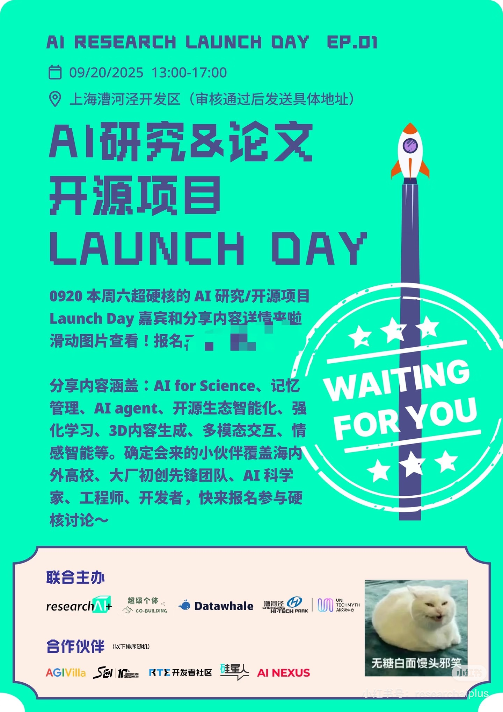
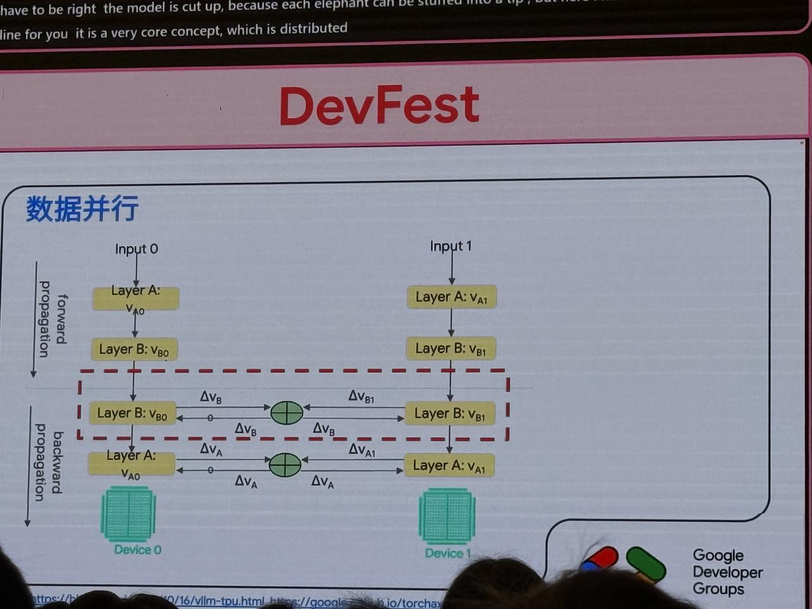
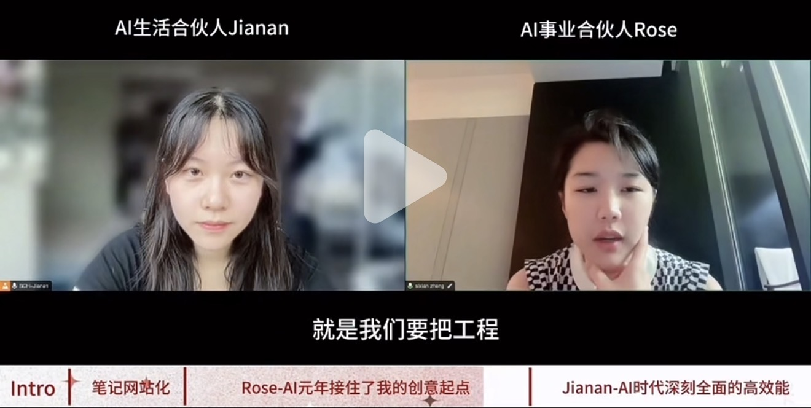

# 乐创营 Core Team 加入策划案

> 申请人：健安 · 质量与技术部 LuZhi · 方向：AI Engineer × Product Owner

---

## 01 / 乐创营生态结构

**核心三角关系：**

| 节点 | 角色 |
|------|------|
| 业务端 | 出需求，定方向 |
| 创造营 | 底层能力建设，专家 Know-how |
| 乐创营 Core | 浇灌与修剪，运营与策划 |

**结构说明（vision-block）**

乐创营并非单纯的兴趣社团，而是连接业务需求、内部技术能力与外部生态的三位一体枢纽。Core Team 扮演"浇灌者"与"修剪者"的双重角色——既要让知识在组织内自由流动，也要保持活动的质量与节奏感。对我而言，这是将 AI 工程实践、内容创作与跨部门协作整合为一体的理想场域。

---

## 02 / 活动生态全景

### INTERNAL · 内部活动体系

| 活动名称 | 描述 | 标签 |
|----------|------|------|
| Best Practice 交流 | 线上实时分享 AI 最佳实践案例，沉淀为组织内的可复用知识资产。如热门工具解析/论文解析/工程实践经验/ | ONLINE/公众号稿件 |
>

| 医疗 × AI 热点 Agent | 前期：组织分享的形式，将X，Podcast，论文，公众号信息整合输出优质信息源；中期：搭建自动化稿件生产 Agent，定期输出医疗行业与 AI 实时热点深度内容。后期引入架构体系，观测阅读量/数据趋势，自动捕捉企业员工层/战略层/管理层关注的信息源 | AI AGENT/公众号稿件 |
> 

| I/O 大会 | 对标 Google I/O 风格，定期汇聚内部 AI 实践成果，形成高密度知识输出节点。 | KEYNOTE EVENT |
>

| AI 步道者播客 | 采访内部 AI 实践者，制作播客内容，建立有温度的知识传播渠道。 | ONLINE/公众号稿件/PODCAST |
>

| AI Side Project 沙龙 | 定期组织 AI 副项目分享，激活个人创造力，构建跨部门的创新连接。 | SALON/公众号稿件 |
>

| 线下主题培训 | 面向不同技能层级设计差异化培训内容，从工具使用到系统思维全覆盖。 | TRAINING/公众号稿件 |
> 

### COLLABORATION · SSME多部门协作

| 活动名称 | 描述 | 标签 |
|----------|------|------|
| AI 观点辩论赛 | 联合 Young Pie，围绕 AI 时代热点议题展开诙谐热闹为主的话题，引发大家关注和思考。 | YOUNG PIE |
| LeanClub 企业拜访 | 与 LeanClub 协同开展标杆企业参访，对接一线 AI 落地实践经验。 | LEANCLUB |
| 校企合作项目 | 建立高校合作渠道，引入学术前沿视角，同时为企业输送年轻创造力。 | ACADEMIA |

### EXTERNAL · 外部生态参与

| 活动名称 | 描述 | 标签 |
|----------|------|------|
| 官方AI 主题竞赛 | 组织团队参与行业顶级 AI 竞赛，以赛促练，提升成员个人knowhow和企业影响力。 | COMPETITION |
| 高价值展会| WAIC/Google Dev Festval/Cursor Meetsup| Conference |
| 创客松 Hackathon | 48h 高密度创造，将内部 AI 能力转化为可演示的产品原型与解决方案。 | HACKATHON |
| 技能交流会 | 跨公司、跨行业的 AI 技能共享活动，拓展外部人脉网络与方法论视野。 | NETWORKING |

| 主题开放麦 | 低门槛、高包容度的创意表达场所，让每一个 AI 实践故事都值得被听见。 | OPEN MIC |

---

## 03 / 我能为 Core Team 带来什么

1. **AI Agent 工程能力**
   具备完整的 Agent 系统搭建经验（OpenClaw、R·Agent），可框架设计落地「医疗热点稿件 Agent」等自动化内容工具，降低人工运营成本。

2. **内容创作 × 小红书实战**
   有 AI 工具建设过程的内容化经验，能将技术实践转化为大众可读的叙事，为播客、稿件、社群传播提供稳定产出。

3. **跨部门 Product Owner 视角**
   横跨 QT / ISE / DTI / MP 的协作经验，擅长需求拆解与优先级判断，可担任内外部活动的策划统筹与协调节点。

4. **个人 AI 生产力系统**
   自建多 Agent 个人效率系统（AWS + Discord + Airtable），能为 Core Team 提供低成本、高可用的运营工具底座。

5. **高质量信息源聚合与实践**
   上述的信息吸收/信息学习/Agent框架研究/内容输出分享/活动组织协办/信息沉淀，经验回流

---

## 04 / 加入后的三阶段成长路径

### PHASE 01 · 入营kickoff后 1–2 月：熟悉生态，快速交付

- 深度了解乐创营现有活动节奏与成员协作方式
- 主动认领并完成 1 个具体任务（如一期播客选题策划或一次沙龙组织）
- 搭建「医疗 × AI 热点」自动化稿件 Agent 的 MVP 原型

### PHASE 02 · 3–6 月：建立专属贡献模块

- 主导一场 AI Side Project 沙龙（以 OpenClaw 实战为内容主轴）
- 与 Young Pie 团队推进 AI 辩论赛选题与赛制设计
- 为 I/O 大会贡献一个完整的议题方案或技术演讲
- 将稿件 Agent 正式上线，输出第一批医疗 AI 内容

### PHASE 03 · 6 月+：连接内外，扩大影响

- 参与或组队参加 1 场外部 AI 竞赛 / 创客松，代表乐创营展示战果
- 推动校企合作落地，对接 1 个高校合作节点
- 协助 Core Team 系统化沉淀活动方法论，形成可复用的运营 SOP

---

## 05 / FY26（6mons）预期贡献量化

| 指标 | 目标值 | 说明 |
|------|--------|------|
| 乐创营年度活动策划 | 1-3场 | 覆盖内部 + 合作 + 双轨 |
| 骇客松比赛 | 1-2场 | 已有实践✅ |
| 稿件生产自动化率 | 50% | 半人工稳定输出季刊公众号，Agent 落地后输入月刊 |

---

## 结语

> 我希望能成为乐创营中那个既能写代码、又能写故事、还能浇灌生态的参与者和建设者。

